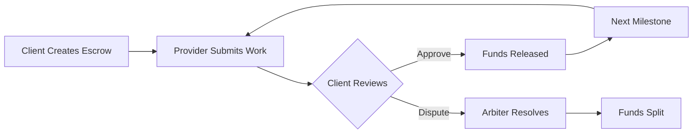

# 📜 StreamCrow: Milestone-Based Escrow on Solana

<div align="center">


*Progressive milestone-based escrow smart contract for trustless payments*

</div>

---

## 🚀 Overview

**StreamCrow** is a milestone-based escrow smart contract built on Solana using the Anchor framework. Unlike traditional all-or-nothing escrow systems, StreamCrow enables progressive fund releases as milestones are completed and approved.

### Perfect For:
- 💻 **Freelance payments** - Pay developers as features are delivered
- 📑 **Service contracts** - Release payments for completed work phases  
- 🏗️ **DAO-funded projects** - Progressive funding for community initiatives
- 🔁 **Subscription agreements** - Milestone-based recurring payments

---

## ✨ Key Features

| Feature | Description |
|---------|-------------|
| 🎯 **Milestone-based payouts** | Funds released progressively, not all at once |
| 🔒 **Trustless fund holding** | Escrow funds secured in program-owned PDA vault |
| ⚖️ **Dispute resolution** | Built-in arbitration system for conflict resolution |
| 🤝 **Fair fund splitting** | Arbiters can distribute funds equitably during disputes |
| 🪙 **Token-agnostic** | Compatible with any SPL token (USDC, USDT, custom tokens) |
| 🛡️ **Security-first** | Anchor framework ensures type safety and validation |

---

## 🔄 Workflow



### Step-by-Step Process:

1. **📝 Client creates escrow**
   - Defines milestones and payment amounts
   - Deposits total funds into secure PDA vault

2. **🚀 Provider submits milestone** 
   - Marks current milestone work as completed
   - Triggers notification to client

3. **✅ Client approves milestone**
   - Reviews submitted work
   - Approval releases funds to provider automatically

4. **⚠️ Dispute handling**
   - Either party can raise disputes
   - Designated arbiter reviews and splits funds fairly

---

## ⚡ Smart Contract Instructions

| Instruction | Description | Actor |
|-------------|-------------|--------|
| `create_escrow` | Initialize escrow and deposit funds into PDA vault | Client |
| `submit_milestone` | Submit completed work for current milestone | Provider |  
| `approve_milestone` | Approve milestone → automatic fund release | Client |
| `dispute_milestone` | Raise dispute on current milestone | Client/Provider |
| `resolve_dispute` | Resolve dispute and distribute funds | Arbiter |

---

## 📂 Repository Structure

```
streamcrow/
├── 📁 programs/
│   └── streamcrow/
│       └── 📄 src/lib.rs           # Core Anchor program logic
├── 📁 tests/
│   └── 📄 streamcrow.test.ts       # Integration test suite
├── 📁 app/                         # Frontend application (Coming Soon)
│   ├── components/
│   ├── pages/
│   └── utils/
├── 📄 Anchor.toml                  # Anchor configuration
├── 📄 Cargo.toml                   # Rust dependencies
└── 📄 README.md                    # This file
```

---

## 🛠️ Getting Started

### Prerequisites

Make sure you have these tools installed:

- **Rust** - [Install Rust](https://rustup.rs/)
- **Solana CLI** - [Install Solana](https://docs.solana.com/cli/install-solana-cli-tools)
- **Anchor Framework** - [Install Anchor](https://www.anchor-lang.com/docs/installation)

### Quick Start

```bash
# 📥 Clone the repository
git clone https://github.com/yourusername/streamcrow.git
cd streamcrow

# 🔨 Build the program
anchor build

# 🚀 Deploy to localnet
anchor deploy

# 🧪 Run tests
anchor test
```

### Local Development

```bash
# Start local Solana validator
solana-test-validator

# In another terminal, deploy to localnet
anchor deploy --provider.cluster localnet

# Run integration tests
anchor test --skip-local-validator
```

---

## 🧪 Testing

Run the comprehensive test suite:

```bash
# Run all tests
anchor test

# Run specific test file
anchor test tests/streamcrow.test.ts

# Run with detailed output
anchor test --verbose
```

---

## 🏗️ Architecture

### Program Data Accounts (PDAs)

- **Escrow Account**: Stores milestone definitions, current state, and participant addresses
- **Vault Account**: Holds escrowed funds securely until milestone completion
- **Milestone Account**: Tracks individual milestone status and payment amounts

### Security Features

- ✅ **PDA-based fund custody** - No private key risks
- ✅ **Input validation** - All parameters validated on-chain  
- ✅ **Access control** - Role-based function permissions
- ✅ **Reentrancy protection** - Safe state transitions

---

<div align="center">

**Built with ❤️ on Solana**


</div>